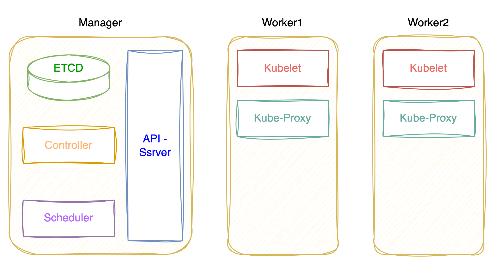
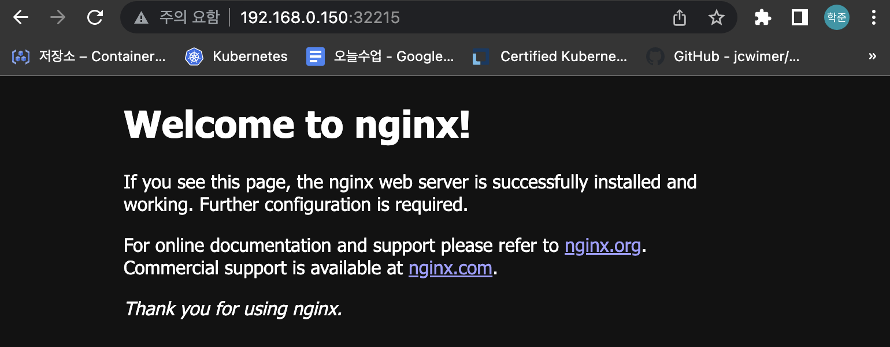

# Kubernetes 클러스터 구축하기

## Kubernetes 클러스터 개요

### Kubernetes 클러스터 구성 종류

Kubernetes를 구성하는 방법은 여러가지가 있다.

* 클라우드 플랫폼을 사용한 구성 - AWS(EKS), GCP(Kubernetes Engine)
* 로컬 구성 - kubeadm
  그 중 `로컬 구성`을 통해 Kubernetes Cluster를 구축한다.

### Kubernetes 클러스터 구성요소



* Master Node 구성 요소

  * `API-Server` - 명령 전달
  * `ETCD` - Key:Value로 이루어진 데이터 집합소, 파드의 상태를 비롯한 모든 정보 저장
  * `Controller` - Pod가 정상적으로 동작하는지 제어
  * `Scheduler` - Pod를 어떤 Node에 배치할 지 결정
* Worker Node 구성 요소

  * `Kubelet` - 중간 관리자 역할 수행
  * `Kube-proxy` - Pod Network 구성

`API-Server`는 멱등성을 보장한다. 만약 Nginx 라는 이름의 `Pod`를 배치하는 요청을 받은 경우 `API-Server`는 `ETCD`의 정보를 확인하고,  `Pod`가 존재한다면, 별다른 행위를 하지 않고, `ETCD`로 부터 Nginx라는 `Pod`가 없다고 반환 받는다면 `Controller`에 `Pod`를 생성하라고 명령한다. 그러면 `Controller`는 `Pod`를 생성함과 동시에 `API`에게 생성 했다고 알리고, `API-Server`는 `Scheduler`에게 `Pod`를 배치하라고 명령한다.

`Scheduler`는 `Pod`를 배치 할 적절한 Node를 찾게 되면 해당 Worker Node의 `Kubelet`에게 `Pod`를 배치하라고 명령하고, `Pod`를 배치하게 된다.

`Kubelet`은 자신의 노드에 배치 된 `Pod`의 상태를 모니터링 한다, 만약 `Pod`가 죽으면 `Kubelet`은 `API-Server`에게 알리고, `API-Server`는 `Controller` → `Scheduler`에 `Pod` 배치를 명령하여 새로운 `Pod`를 배치하도록 해준다.

## Kubernetes 클러스터 구축

### 목표

* Master Node(Control Plane) 1대, Worker Node 2대로 구성 된 Kubernetes클러스터 구축하기
* Nginx 이미지를 사용하여  Pod를 배포하여 웹 서비스 구성하기

### 구성 환경

* Infra : On-Premise(Vmware)
* Network : Local(192.168.0.0/24)
* OS : Ubuntu Server 20.04.5 3대
* Compute Resource :
  * CPU : 4 Core
  * RAM : 4 GB
* Host별 IP, 고유 Hostname 설정 후 상호간 통신이 가능해야 함

### Master, Worker Node 공통 구성

Master, Worker1, Worker2 노드에 동일하게 아래 명령을 통해 패키지 설치 및 구성을 진행한다. Kubernetes 컨테이너 엔진은 Docker를 사용한다.

<h4> Swap Memory 비활성화

```bash
sudo swapoff /swap.img
sudo sed -i -e '/swap.img/d' /etc/fstab
```

<h3>Docker Engine 설치

```bash
curl -fsSL https://get.docker.com -o get-docker.sh
sudo sh get-docker.sh
systemctl restart docker
systemctl enable docker
```

<h3>Container Runtime 설치

Kubernetes는 1.24 이후 Docker 컨테이너 런타임의 기본 지원을 종료하였기 때문에 cri-docker를 추가 설치하여 Docker와 Kubernetes를 연결해야 한다.

```bash
git clone https://github.com/Mirantis/cri-dockerd.git
wget https://storage.googleapis.com/golang/getgo/installer_linux
chmod +x ./installer_linux
./installer_linux
source ~/.bash_profile
cd cri-dockerd
mkdir bin
go build -o bin/cri-dockerd
mkdir -p /usr/local/bin
install -o root -g root -m 0755 bin/cri-dockerd /usr/local/bin/cri-dockerd
cp -a packaging/systemd/* /etc/systemd/system
sed -i -e 's,/usr/bin/cri-dockerd,/usr/local/bin/cri-dockerd,' /etc/systemd/system/cri-docker.service
systemctl daemon-reload
systemctl enable cri-docker.service
systemctl enable --now cri-docker.socket
sudo systemctl restart docker && sudo systemctl restart cri-docker
sudo systemctl status cri-docker.socket --no-pager

# Docker Cgroup 변경.
cat <<EOF | sudo tee /etc/docker/daemon.json
{
  "exec-opts": ["native.cgroupdriver=systemd"],
  "log-driver": "json-file",
  "log-opts": {
	"max-size": "100m"
  },
  "storage-driver": "overlay2"
}
EOF
```

<h3>Kernel Forwarding, kube-proxy 설정

```bash
cat <<EOF | sudo tee /etc/modules-load.d/k8s.conf
br_netfilter
EOF

# iptable이 오버레이 네트워크의 트래픽을 허용하도록 설정.
cat <<EOF | sudo tee /etc/sysctl.d/k8s.conf
net.bridge.bridge-nf-call-ip6tables = 1
net.bridge.bridge-nf-call-iptables = 1
EOF
```

<h3>kubelet, kubeadm, kubectl 설치

```bash
sudo apt-get update
sudo apt-get install -y apt-transport-https ca-certificates curl
sudo curl -fsSLo /usr/share/keyrings/kubernetes-archive-keyring.gpg https://packages.cloud.google.com/apt/doc/apt-key.gpg
echo "deb [signed-by=/usr/share/keyrings/kubernetes-archive-keyring.gpg] https://apt.kubernetes.io/ kubernetes-xenial main" | sudo tee /etc/apt/sources.list.d/kubernetes.list
sudo apt-get update
sudo apt-get install -y kubelet kubeadm kubectl

# 해당 버전으로 고정
sudo apt-mark hold kubelet kubeadm kubectl
```

### Master Node 구성

<h3>클러스터 생성 시 필요한 이미지 Pull

```bash
sudo kubeadm config images pull --cri-socket unix:///run/cri-dockerd.sock
```

<h3>Cluster 생성

```bash
sudo kubeadm init --pod-network-cidr=10.10.0.0/16 --apiserver-advertise-address={master-ip} --cri-socket /var/run/cri-dockerd.sock
```

<h3>워커 노드의 Join을 위해 명령어를 복사 해 둔다.

```bash
kubeadm join {master-ip}:6443 --token a23v07.704hxxkjfv476512 \
	--discovery-token-ca-cert-hash sha256:92d4a0816e765538a9fc3d0e22f5b775bd1786952ae196ce6e2c991fc8ff79e9 \
        --cri-socket /var/run/cri-dockerd.sock
```

<h3> kubeadm 을 root 처럼 사용하기 위한 추가 설정

```bash
mkdir -p $HOME/.kube
sudo cp -i /etc/kubernetes/admin.conf $HOME/.kube/config
sudo chown $(id -u):$(id -g) $HOME/.kube/config
```

### Worker Node 구성

Master Node의 클러스터에 Join하기 위해 위 Join 명령어를 Worker Node에서 실행한다. docker 엔진을 사용했기 때문에, `--cri-socket` 옵션을 사용해야 한다.

```bash
kubeadm join {master-ip}:6443 --token a23v07.704hxxkjfv476512 \
	--discovery-token-ca-cert-hash sha256:92d4a0816e765538a9fc3d0e22f5b775bd1786952ae196ce6e2c991fc8ff79e9 \
        --cri-socket /var/run/cri-dockerd.sock
```

### CNI 구성

CNI(Container Network Interface)는 컨테이너 네트워크를 구성하기 위한 플러그인이다. weavenet, calico 등의 오픈소스 플러그인이 존재하는데 caclico라는 CNI를 사용하여 구성한다. 이 작업은 `Master Node`에서 진행해야 한다.

<h3> Calico 패키지 설치

```bash
kubectl create -f https://raw.githubusercontent.com/projectcalico/calico/v3.25.0/manifests/tigera-operator.yaml
```

<h3> CNI Network 정의

Master Node에서 클러스터 생성(kubeadm init)할 때 pod network의 범위를 10.10.0.0/16으로 지정했기 때문에, Calico의 custom-resources.yaml 파일을 다운로드 하고 Pod Network 설정을 변경한 후 배포한다.

```bash
curl https://raw.githubusercontent.com/projectcalico/calico/v3.25.0/manifests/custom-resources.yaml -O
sed -i -e 's?192.168.0.0/16?10.10.0.0/16?g' custom-resources.yaml
kubectl apply -f calico.yaml
```

### Node 상태 확인하기

`kubectl get node` 명령을 통해 Kubernetes 클러스터 구축이 완료됐는지 확인한다.

```
NAME      STATUS   ROLES           AGE   VERSION
master    Ready    control-plane   55m   v1.26.1
worker1   Ready    <none>          42m   v1.26.1
worker2   Ready    <none>          42m   v1.26.1
```

## Pod 배포하기

### Pod 배포

간단한 명령어를 사용하여 Nginx 이미지를 사용하여 Pod를 배포 한다.

```bash
kubectl run web --image=nginx
```

아래 명령어를 사용해 Pod가 정상적으로 배포된 것을 확인할 수 있다.

```bash
kubectl get pod
```

```
NAME   READY   STATUS    RESTARTS   AGE
web    1/1     Running   0          80s
```

### Service 배포

Pod에 있는 nginx에 접근하기 위해 expose 명령어로 노출시킨다.(Service NodePort 생성)

```bash
kubectl expose pod web --name=web-svc --type=NodePort --port=80 --target-port=80
```

아래 명령어를 사용해 노출된 NodePort번호를 확인하고, 해당 Port로 웹 브라우저를 통해 접근한다.

```bash
kubectl get svc
```

```
NAME         TYPE        CLUSTER-IP      EXTERNAL-IP   PORT(S)        AGE
web-svc      NodePort    10.101.179.53   <none>        80:32215/TCP   88s
```

### 웹 브라우저 접속 확인


