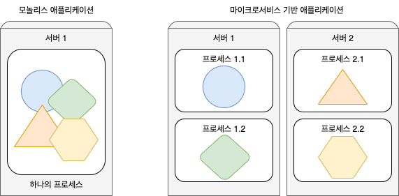

# 쿠버네티스 소개

쿠버네티스, 컨테이너 기술이 도입되기 전 대부분의 소프트웨어 애플리케이션은 하나의 프로세스 또는 몇 개의 서버에 분산된 프로세스로 실행하는 거대한 모놀리스였다. 이런 레거시 시스템은 릴리즈 주기가 느리고, 개발자는 전체 릴리즈 주기가 끝날 때마다 전체 시스템을 패키징 하고 운영팀에게 넘기고, 운영팀은 이를 운용 가능한 서버로 직접 마이그레이션 했다.

이런 거대한 모놀리스 레거시 애플리케이션은 점차 마이크로 서비스라는 독립적으로 실행되는 더 작은 구성요소로 세분화 됐다. 마이크로 서비스는 서로 분리돼 있기 때문에 서비스 개별적으로 개발, 배포, 업데이트, 확장할 수 있다. 하지만 세분화가 많이 될수록 관리해야 할 운영 포인트가 증가하여 이를 유지하는데 어려움이 생기게 됐다.

이런 구성 요소의 서버 배포를 자동으로 스케쥴링하고 구성, 관리, 장애 처리를 포함하는 자동화 구현을 위해 쿠버네티스가 등장하게 됐다.

> | Note |  쿠버네티스란 명칭은 키잡이(helmsman)나 파일럿을 뜻하는 그리스어에서 유래했다. K8s라는 표기는 "K"와 "s"와 그 사이에 있는 8글자를 나타내는 약식 표기이다. 구글이 2014년에 쿠버네티스 프로젝트를 오픈소스화했다. 쿠버네티스는 프로덕션 워크로드를 대규모로 운영하는 [15년 이상의 구글 경험](https://kubernetes.io/blog/2015/04/borg-predecessor-to-kubernetes/)과 커뮤니티의 최고의 아이디어와 적용 사례가 결합되어 있다.

쿠버네티스는 하드웨어 인프라를 추상화하고 데이터 센터 전체를 하나의 거대한 컴퓨팅 리소스로 제공한다. 실제 세세한 서버 정보를 알 필요 없이 애플리케이션 구성 요소를 배포하고 실행 할 수 있다.

## 쿠버네티스가 필요한 이유

쿠버네티스에 대해 자세히 살펴보기 전 애플리케이션의 개발과 배포 방식이 어떻게 바뀌었는지 살펴보자. 소프트웨어 애플리케이션을 작은 마이크로 서비스로 세분화하며 도커와 같은 컨테이너 기술을 사용하는 것의 이점을 더 잘알 수 있을 것이다.

모놀리스 애플리케이션은 아래와 같은 특징(문제)을 가지고 있다.

1. 애플리케이션의 모든 것이 서로 강하게 결합돼 있다.
2. 전체가 하나의 운영체제 프로세스로 실행되기 때문에 하나의 개체로 개발, 배포, 관리된다.
3. 애플리케이션의 한 부분만 변경하더라도, 전체 애플리케이션을 재배포 해야한다.
4. 시간이 지남에 따라 구성요소간 경계가 불분명해지고, 상호의존성의 제약이 증가하여 시스템 복잡성이 증가한다.

### 마이크로 서비스로 애플리케이션 분할

이런 특징들로 복잡한 모놀리스 애플리케이션을 마이크로서비스라는 독립적으로 배포할 수 있는 작은 구성요소로 분할해야 한다. 각 마이크로서비스는 독립적인 프로세스로 실행되며, 단순하고 잘 정의된 인터페이스로 다른 마이크로서비스와 통신한다.

